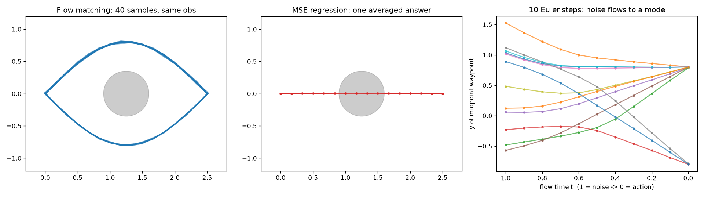
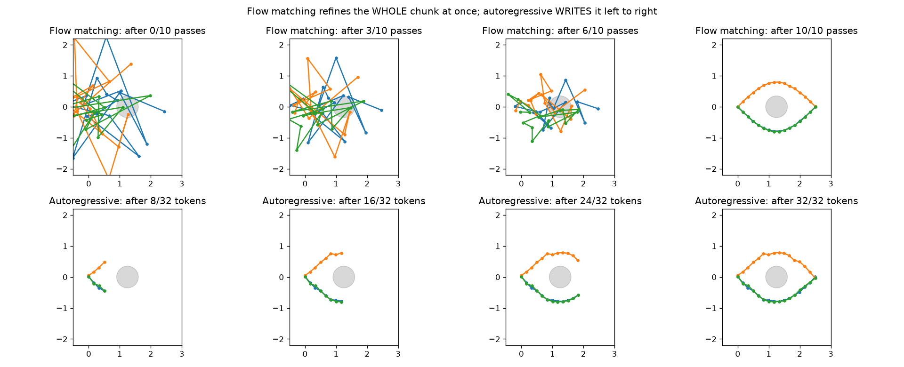
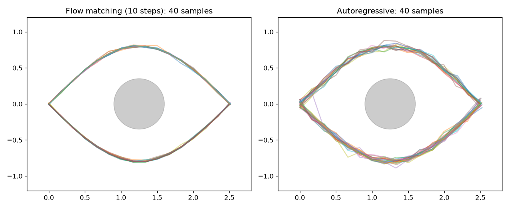

# Flow matching vs autoregressive actions: a laptop-sized look at VLAs like π0.5

Two small PyTorch scripts that show, on a toy robot task, how vision-language-action (VLA) models produce actions:

- **Flow matching**, the approach used by π0 / π0.5: start from random noise and refine a whole chunk of actions over 10 passes.
- **Autoregressive tokens**, the approach used by RT-2 / OpenVLA: round each action value into a bin and write the chunk one token at a time, like an LLM.

This is the companion code for the blog post **[How Robot Brains Actually Move: The Nuances of VLA Models Like π0.5](https://medium.com/@dvij_sj12/how-robot-brains-actually-move-the-nuances-of-vla-models-like-%CF%800-5-9583a9ade56d)** on Medium.

Everything runs on a laptop CPU. No GPU and no model downloads are needed: the models are tiny and trained from scratch on synthetic data. They reproduce the *method* π0.5 uses, not π0.5 itself.

## The toy task

A 2D "robot" must travel from the origin to a goal with an obstacle in the middle. The demonstrations go around it **above** half the time and **below** the other half, so there are two equally correct answers for the same observation. That's the situation that separates good action heads from bad ones.

## Scripts

### `toy_flow_matching.py` (about 3 minutes)

Trains a flow-matching "action expert" and a plain regression baseline.

- Uses the same formulation as openpi's π0 / π0.5: `x_t = t·noise + (1−t)·actions`, target velocity `noise − actions`, time sampled from `Beta(1.5, 1)`, 10 Euler steps from `t=1` to `t=0` at inference.
- Tells the network the flow time through adaptive RMSNorm, as π0.5's action expert does.



**Takeaway:** flow matching commits to one route per sample. Regression averages the two routes and drives through the obstacle.

### `compare_ar_vs_flow.py` (about 9 minutes)

Trains a small GPT-style autoregressive policy (256 bins per value, 32 tokens per path) and compares it with the flow-matching model from the first script. It prints a table of passes, time, route split, error and smoothness.





**Takeaways:**
- Both handle the two routes; neither hits the obstacle.
- Flow matching needs 10 passes per path, the autoregressive model 32. For a real robot chunk (50 timesteps × 32 values) that gap becomes 10 vs 1,600.
- Flow matching produces smoother paths; the autoregressive model reproduces the jitter in the training data.

These are untuned toy models: treat the numbers as an illustration, not a benchmark.

## Running

Requires Python 3.10+.

```bash
python -m venv .venv
source .venv/bin/activate
pip install -r requirements.txt

python toy_flow_matching.py       # writes toy_flow_matching.png
python compare_ar_vs_flow.py      # writes compare_generation.png and compare_samples.png
```

## References

- Physical Intelligence, *π0.5: a Vision-Language-Action Model with Open-World Generalization* (2025)
- Physical Intelligence, *π0: A Vision-Language-Action Flow Model for General Robot Control* (2024)
- Physical Intelligence, *FAST: Efficient Action Tokenization for Vision-Language-Action Models* (2025)
- [openpi](https://github.com/Physical-Intelligence/openpi): the official π0 / π0.5 code
- Lipman et al., *Flow Matching for Generative Modeling* (2022)
